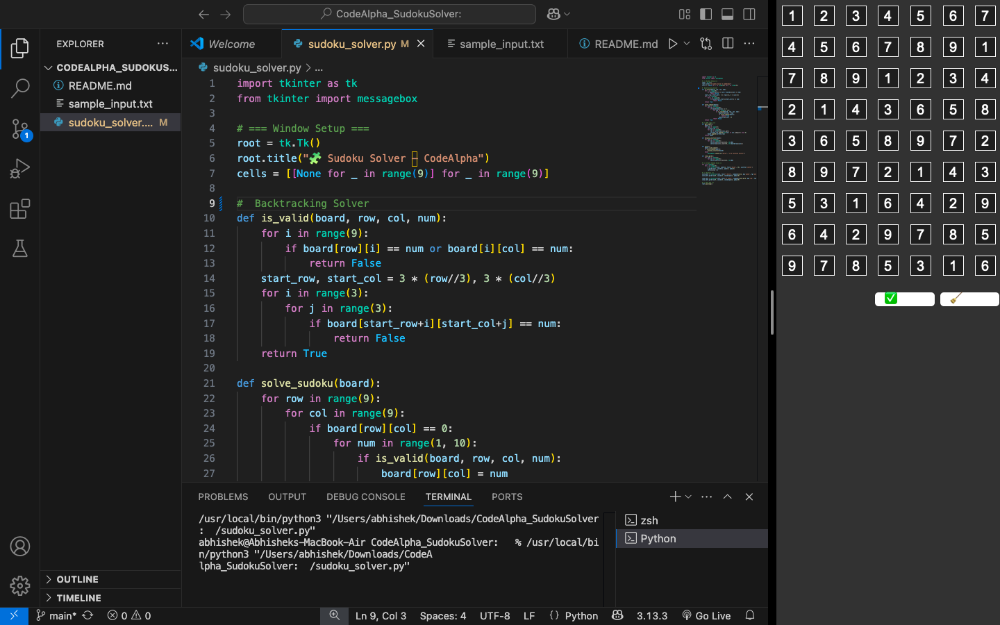

# 🧩 CodeAlpha Sudoku Solver – GUI Version

This project was created as part of the **App Development Internship** at [CodeAlpha](https://codealpha.tech). It is a fully functional **GUI-based Sudoku Solver** built using Python and Tkinter. The application allows users to manually input Sudoku puzzles, solve them using backtracking, and view the completed grid — all in a clean and interactive interface.

---

## ✅ Features

- 🧠 Solves any valid 9×9 Sudoku puzzle using backtracking
- 💻 Interactive 9×9 GUI built with Tkinter
- 🖱️ "Solve" button to compute and display solution
- 🔄 "Clear" button to reset the board
- 🚫 Displays error if the puzzle is unsolvable

---

## 🛠️ Tech Stack

- **Language:** Python 3
- **GUI:** Tkinter (built-in Python library)
- **Algorithm:** Backtracking

---

## 📸 Output Screenshot

### Initial Input Grid:


> 📌 You can enter any puzzle manually, then press **"Solve"** to see the completed Sudoku instantly.

---

## 🚀 How to Run the Project

### 1️⃣ Clone the Repository

```bash
git clone https://github.com/YOUR_USERNAME/CodeAlpha_SudokuSolver_GUI.git
cd CodeAlpha_SudokuSolver_GUI


---

## 📂 Folder Structure


CodeAlpha_SudokuSolver_GUI/
├── codealpha_sudoku_gui.py       # Main GUI app
├── output.png                    # Screenshot of working app
└── README.md                     # Project documentation


📬 Author
Abhishek Singh
MCA Student, Presidency University, Bangalore
🔗 GitHub: github.com/Abhiishek0


## 📢 Acknowledgement


This project was completed under the mentorship and guidance of CodeAlpha as part of their App Development Internship.

#CodeAlpha #Python #SudokuSolver #GUIApp #InternshipProject #Tkinter #Backtracking


---
